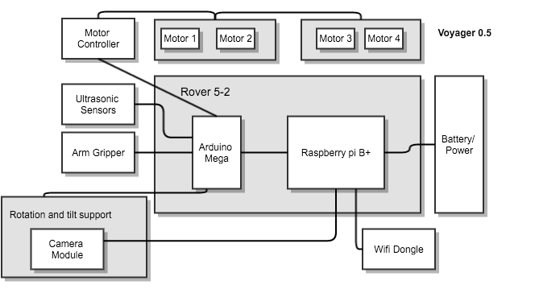

Mercury robot challenge 2016
============================

**Voyager** Technical Document

|logo|

------

**Team**

* Julio Cesar Castellanos  - julio.castellanosa@campusucc.edu.co
* Ivan Dario -  ivan.ortizp@campusucc.edu.co
* Rafael Vergara - Rafael.vergarah@campusucc.edu.co
* Luis Villadiego - luis.villadiego@campusucc.edu.co

Summary
-------

This technical document describes the creation and specs of a remotely controlled robot. The Robot "Voyager"
was designed and built to meet the requirements of the Oklahoma State University Mercury
Robotics competition for 2016 in Bogota, Colombia.

High­level block diagram
-----------------------

|dia|

Communication
-------------

The microcontroller will be conecte via serial to the raspberry pi, on the raspberry we use a Nodejs library in order to expose a real time socket web based server.
For handle browser events we use jQuery and keypress in order to detect when a key is pressed then and do a socket emit.

Main board
----------

The robot uses the Raspberri pi B+ as the principal board, this board allow the commnincation to a higer level user application using a  Sockect TCP server. It is attached direclty to the microcontroller via serial USB port.

Video feedback
--------------

The robot has a camera module attached to the raspberry pi, we expose this camera thougth a UDP video stream server.

Cotroller interface
-------------------

We have a web based interface using HTML,CSS and Javascript to handle browser events.

Drive train
-----------

The robot has one motor per side, each running a tread through a gearbox with an encoder.

Subsystems
----------
The robot has two Ultrasonic sensors......

Power
-----
The robot has a 7.2[V] standard 3000[mAh] NiMH battery.

.. |logo| image:: _static/logo.png

